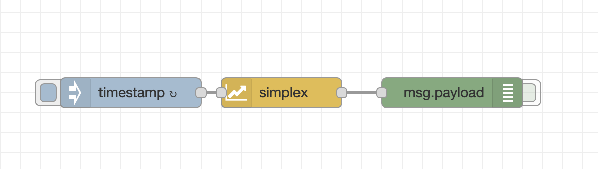
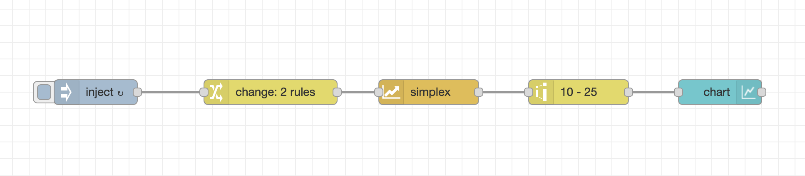

# Simplex Noise Node

This package provides a Node-Red node for creating simplex noise.

## What to use it for?
[Simplex Noise](https://en.wikipedia.org/wiki/Simplex_noise) has classically been used in computer graphics.
However, it can be used everywhere where you want to generate random values that look 'natural'.
For example, you can use 1D random noise to generate fake sensor data.

## How to use

### Simple example

 

The simplest way to use this is to wire up an inject-node to the input and a debug node to the output.
Configure inject-node to set the message payload to the current timestamp and send it every second. Now you get a random
number between -1 and +1 every second! You can import this example from `examples/simple-example.json`.

### Generating natural looking random sequences

Wire up any node that generates a linearly increasing number as an input.
You will get a nice smooth curve if you increase the input value by 0.1 every time you send a message to the node.
The output will be a number between -1 and +1 representing the noise value for the given value.
Note that you will always get the same output for the same input. This will only change after your restart Node-Red.
You can map the output to another value range using the 'range' node. Check out `examples/1d-chart-example.json`
 for a complete example. This example needs the dashboard package and generates a line chart from 1D simplex noise.

### Using multiple input dimensions
You can also send arrays of numbers to the simplex node to generate multidimensional simplex. For example, if you
send the array [1, 2] you will get the noise value at the position (1, 2) in the input space.
The input space can have up to four dimensions which means your input array can be up to four elements long.
All elements after the fourth are ignored. **The output is always a single number between -1 and +1.**

### Generating multiple values at once
If you want to generate multiple values at once, you can send a payload containing an array of arrays of numbers (e.g. 
[[1, 2], [1.1, 2.1]]).
The output will be an array of numbers. For each array in the input array there will be one number in the output array.
Each of these values will be between -1 and 1.
